# MLB Hit Probability

[](https://github.com/LKohn4/mlb-hit-probability/actions/workflows/ci.yml)


Predicting whether a batted ball becomes a hit using **2026 MLB Statcast data** (Opening Night,
March 25, through the final day, September 27), comparing a **random forest** against a
**neural network** under two missing-data strategies, with every model scored the same way on the
same held-out data. The pipeline also builds a set of dashboard-ready figures, including a
hits-above-expected leaderboard.

## Results
## On the 2026 season, the random forest reached 91.24% accuracy using @flanalytics features,but that fell to 83.12% once features recorded after the play were removed. The leak-free model (ROC AUC Z) is the honest measure of how well contact quality alone predicts a hit.

| model | method | accuracy | roc_auc | log_loss | brier | train_time_s |
| --- | --- | --- | --- | --- | --- | --- |
| Random forest | Strict (dropna) | 0.9205 | 0.9425 | 0.2317 | 0.0640 | 0.6359 |
| Neural network | Strict (dropna) | 0.9108 | 0.9380 | 0.2410 | 0.0691 | 4.8253 |
| Random forest | Median / mode | 0.9124 | 0.9462 | 0.2448 | 0.0680 | 0.7002 |
| Neural network | Median / mode | 0.9056 | 0.9426 | 0.2519 | 0.0726 | 4.9403 |
| Random forest | Strict, leak-free | 0.8312 | 0.8925 | 0.3920 | 0.1224 | 0.7677 |
| Neural network | Strict, leak-free | 0.8090 | 0.8670 | 0.4218 | 0.1340 | 4.8836 |

For context: always predicting "out" scores about two-thirds accuracy on its own, because most balls
in play are outs. ROC AUC and log loss show how good the hit *probabilities* are, which matters
more than raw accuracy for a hit-probability model.

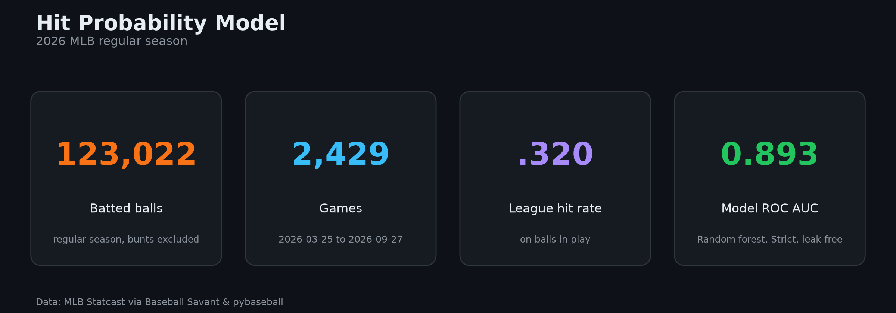

## Dashboard

Every run writes 12 figures to `results/figures/` (2000×1250 px, dark theme, with a source and
credit footer) and the numbers behind each one to `results/dashboard_data/` as CSV. You can post
the images directly or rebuild the charts in Tableau, Power BI, Canva, etc.

| | |
| --- | --- |
| 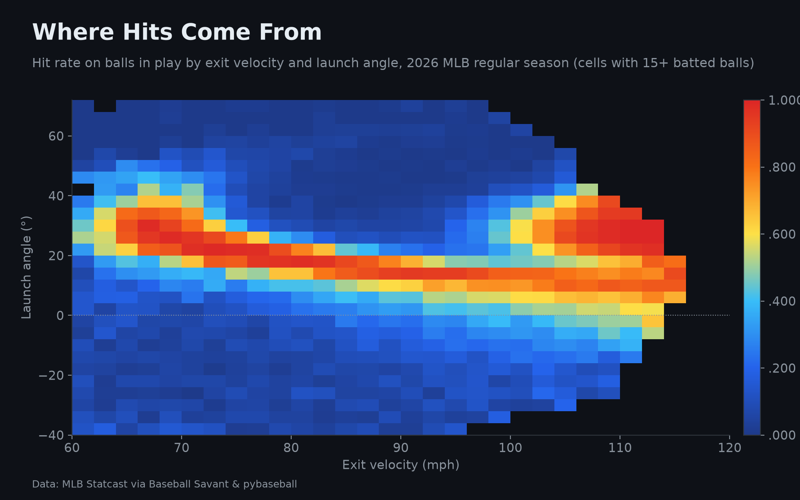 | 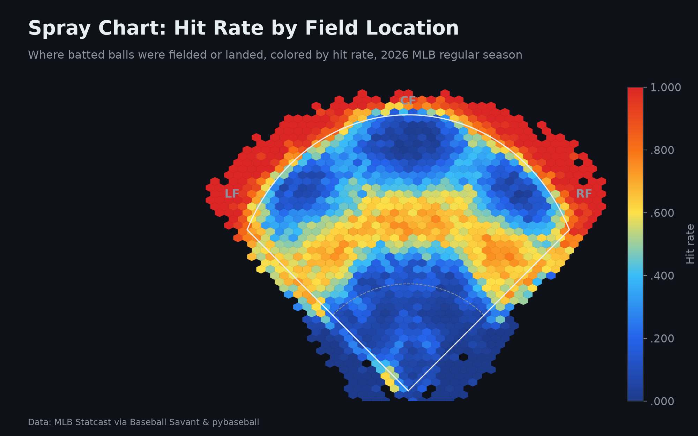 |
| 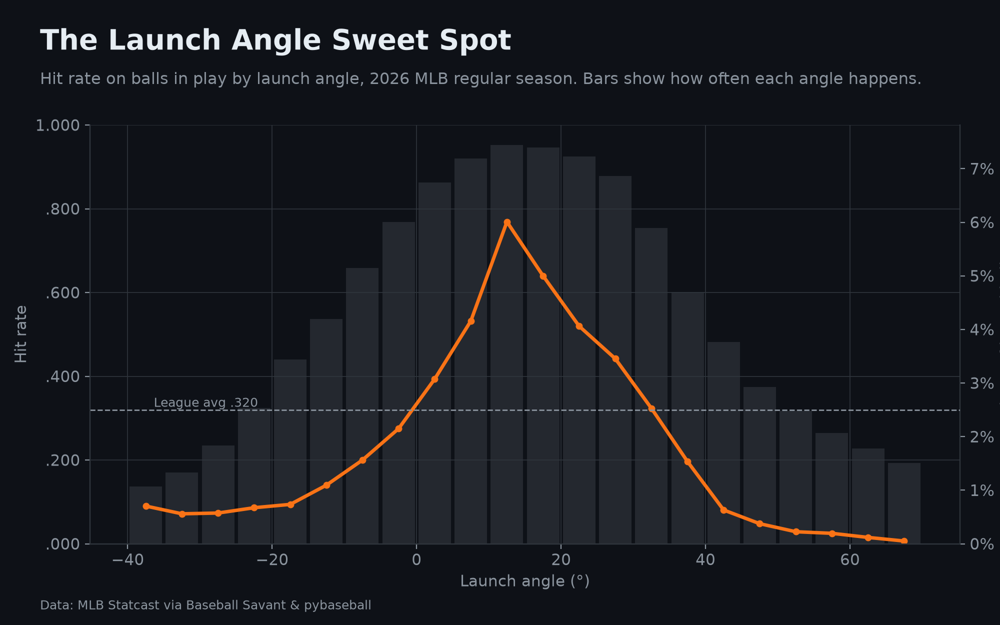 | 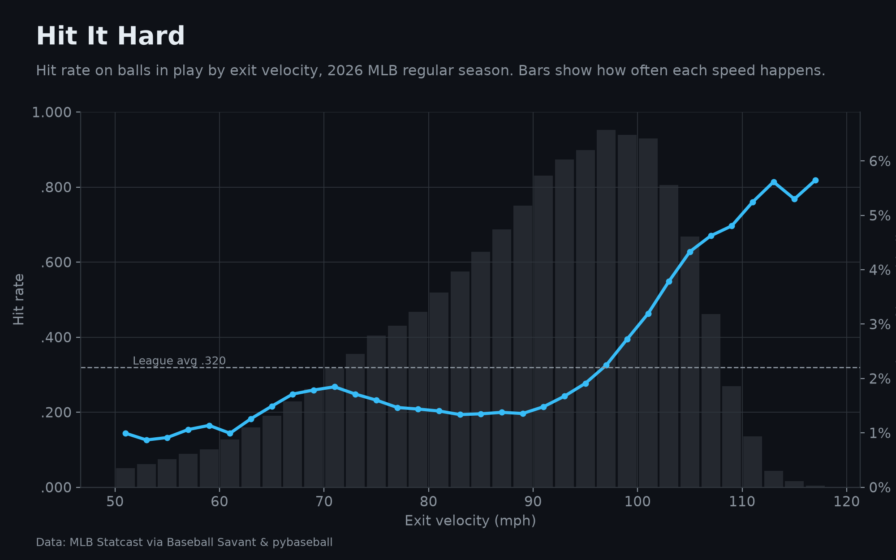 |
| 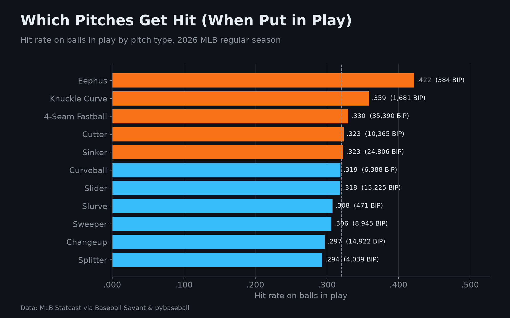 | 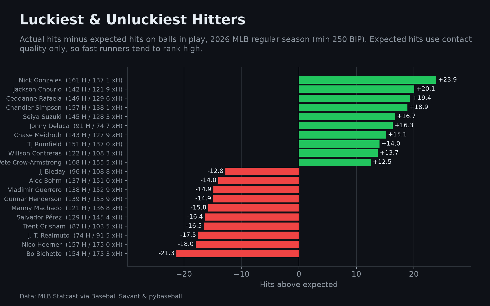 |
| 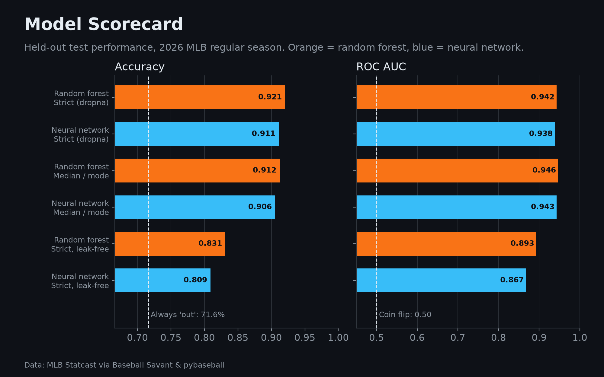 | 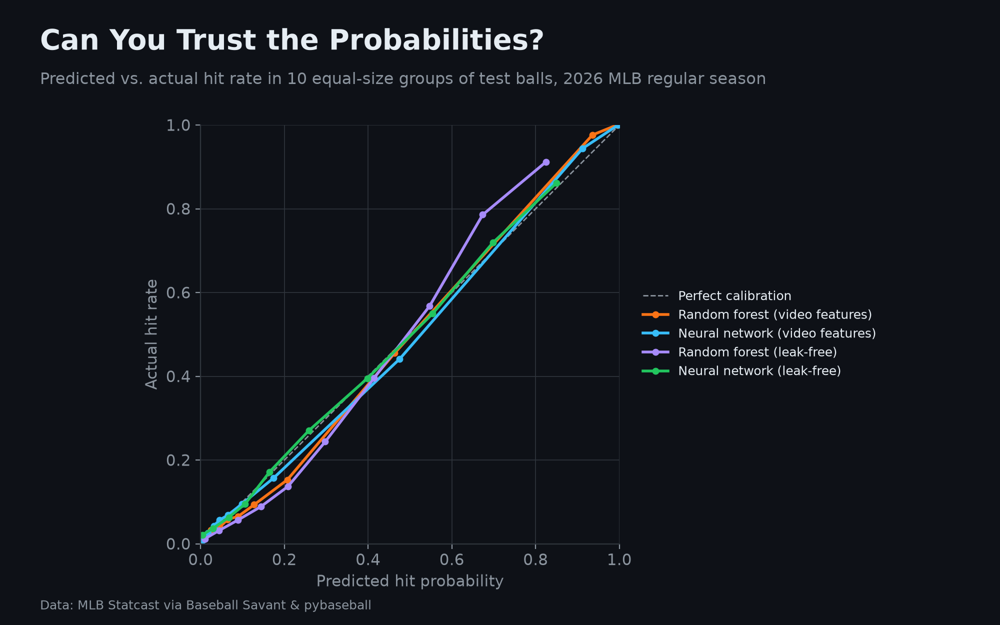 |
| 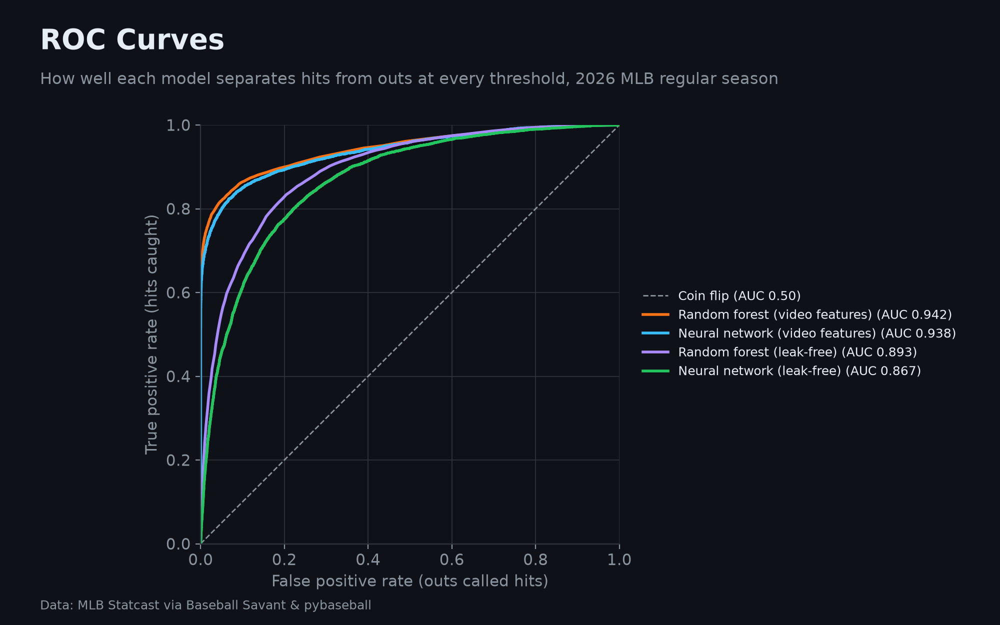 | 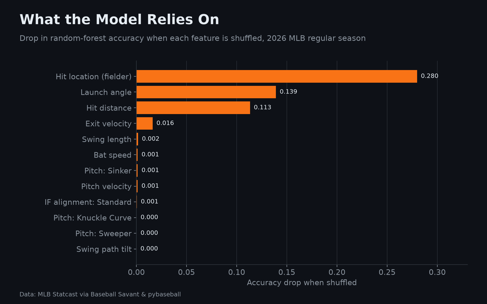 |

| Figure | What it shows |
| --- | --- |
| `season_summary.png` | Headline numbers: batted balls, games, league hit rate, model ROC AUC |
| `hit_rate_heatmap.png` | Hit rate for every exit velocity × launch angle combination |
| `hit_rate_by_launch_angle.png` / `_exit_velocity.png` | Hit rate curves with how often each value occurs |
| `spray_chart.png` | Hit rate across the field |
| `hit_rate_by_pitch_type.png` | Hit rate on balls in play for each pitch type |
| `hits_above_expected.png` | Hitters who beat or fell short of their expected hits |
| `model_comparison.png` | Accuracy and ROC AUC for every model, against baselines |
| `calibration.png` | Whether predicted probabilities match reality |
| `roc_curves.png` | How well each model separates hits from outs |
| `feature_importance.png` | Which inputs the random forest relies on |
| `nn_training_curves.png` | Neural network training vs. validation accuracy |

## Quickstart

```bash
git clone https://github.com/LKohn4/mlb-hit-probability.git
cd mlb-hit-probability
python -m venv .venv
source .venv/bin/activate          # Windows: .venv\Scripts\activate
pip install -e ".[dev]"

hit-probability --credit "Leo Kohn"   # full run; first run downloads the season
```

The first run downloads the full 2026 regular season from Baseball Savant through
[pybaseball](https://github.com/jldbc/pybaseball), which can take 10–30 minutes. The raw data is
cached in `data/`, so later runs skip the download. The log reports the first and last game dates it
found; if the final days are missing because Statcast hadn't posted them yet, re-run later with
`--refresh-data`.

Using PyCharm? See **[docs/PYCHARM_SETUP.md](docs/PYCHARM_SETUP.md)**. The repo includes
ready-made run configurations.

## Usage

```bash
hit-probability --sample-frac 0.1 --epochs 5   # quick iteration on 10% of the data
hit-probability --skip-nn                      # random forests only
hit-probability --refresh-data                 # re-download (e.g. to pick up late games)
hit-probability --min-bip 300                  # stricter leaderboard qualification
hit-probability --start 2025-03-18 --end 2025-09-28 --results-dir results/2025
hit-probability --help                         # all options
```

| Output | Contents |
| --- | --- |
| `results/model_comparison.csv` / `.md` | Accuracy, ROC AUC, log loss, Brier score, and training time per model |
| `results/summary.json` | Row counts, majority-class baseline, the original video's R² metrics |
| `results/missingness.csv` | Share of batted balls missing each feature |
| `results/outcome_survival.csv` | How many of each outcome survive the strict filter |
| `results/figures/` | The 12 dashboard figures above |
| `results/dashboard_data/` | CSV/JSON data behind every figure, including the full leaderboard |

## Methodology

1. **Data:** every pitch from the 2026 regular season (Statcast via pybaseball), filtered to balls in
   play. Non-regular-season games and all bunts are removed.
2. **Target:** `hit` = 1 for single, double, triple, or home run; 0 for outs, fielder's choices, and errors.
3. **Features:** exit velocity, launch angle, bat-tracking metrics (bat speed, swing length, swing path tilt),
   pitch type and velocity, defensive alignment, hit location, and hit distance. Categorical features are
   one-hot encoded.
4. **Missing data**, two strategies:
   - *Strict:* keep only batted balls with every feature present.
   - *Median / mode:* fill gaps using values learned from the training split only.
5. **Models:** a random forest (100 trees) and a neural network (one 64-unit ReLU hidden layer, softmax output,
   20 epochs, batch size 100, standardized inputs).
6. **Evaluation:** an 80/20 stratified split shared by both models; accuracy, ROC AUC, log loss, and Brier
   score, plus impurity and permutation feature importance.
7. **Leak-free check:** `hit_location` (the fielder who handled the ball) and `hit_distance_sc` are partly
   recorded after the ball is in play, which gives the model hints about the outcome. A third experiment
   replaces them with spray angle (horizontal direction off the bat, adjusted for handedness) to measure how
   well the contact itself predicts a hit.
8. **Expected hits:** every batted ball gets an out-of-sample hit probability from the leak-free model
   (5-fold cross-validation, so no ball is scored by a model that trained on it). Summing these per
   batter gives expected hits; actual minus expected gives hits above expected. The model doesn't
   know sprint speed, so fast runners who beat out grounders tend to rank high.

## Project structure

```
mlb-hit-probability/
├── src/hit_probability/
│   ├── config.py        # Feature lists, event filters, run settings
│   ├── data.py          # Download, cache, filter, spray angle
│   ├── features.py      # Strict vs. imputed train/test preparation
│   ├── models.py        # Random forest and neural network training
│   ├── evaluate.py      # Shared metrics and feature importance
│   ├── expected.py      # Expected hits and the hits-above-expected leaderboard
│   ├── dashboard.py     # Builds every figure plus its CSV data
│   ├── plots.py         # Dashboard-styled figures
│   ├── pipeline.py      # End-to-end experiment
│   └── cli.py           # Command-line interface
├── tests/               # Offline tests on synthetic Statcast-shaped data
├── notebooks/           # Step-by-step exploratory notebook
├── docs/PYCHARM_SETUP.md
├── .run/                # Shared PyCharm run configurations
├── data/                # Cached Statcast pulls (git-ignored)
└── results/             # Metrics and figures
```

## Development

```bash
pytest          # 23 tests, runs offline in under a minute
ruff check .    # lint
```

GitHub Actions runs both on every push and pull request (Python 3.11 and 3.12).

## Acknowledgments

- Inspired by the hit-probability project from [@flanalytics](https://www.tiktok.com/@flanalytics). This
  version adds shared evaluation metrics, a majority-class baseline, a leakage check, and imputation fit on
  training data only.
- Data from [Baseball Savant](https://baseballsavant.mlb.com/) via
  [pybaseball](https://github.com/jldbc/pybaseball). Statcast data is the property of MLB Advanced Media and
  is not redistributed in this repository.

## License

[MIT](LICENSE)
